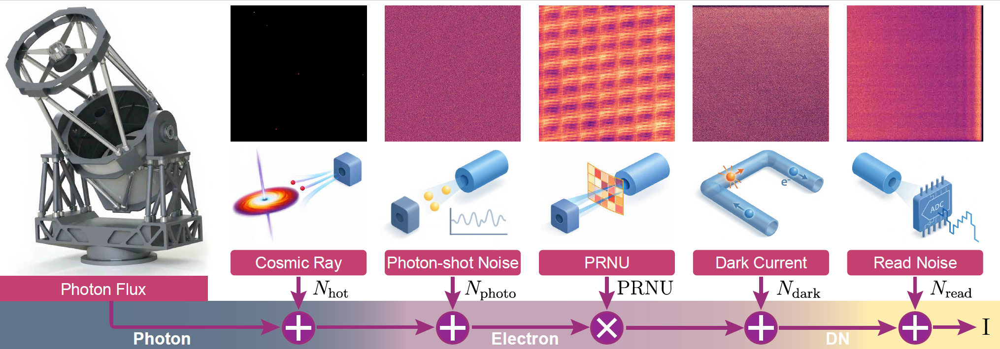

<h1 align="center">Denoising the Deep Sky: Physics-Based CCD Noise Formation for Astronomical Imaging</h1>
<p align="center">
  <a href="https://shuhongll.github.io/">Shuhong Liu</a>,
  Xining Ge,
  <a href="https://scholar.google.com/citations?user=6xQKMNYAAAAJ">Ziying Gu</a>,
  <a href="https://xuquanfeng.github.io/">Quanfeng Xu</a>,
  <a href="https://cuiziteng.github.io/">Ziteng Cui</a>,
  <a href="https://sites.google.com/view/linguedu/home">Lin Gu</a>,
  <a href="https://xg-chu.site/">Xuangeng Chu</a>,
  Jun Liu,
  <a href="https://doongli.github.io/">Dong Li</a>,
  <a href="https://www.mi.t.u-tokyo.ac.jp/harada/">Tatsuya Harada</a>
</p>

<p align="center">
  <a href="https://github.com/ShuhongLL/Denoising-Deep-Sky">
    
  </a>
  <a href="https://arxiv.org/abs/2601.23276">
    
  </a>
  <a href="https://huggingface.co/datasets/ToferFish/MuSCAT-RawImage">
    
  </a>
</p>


---

<p align="center">
  
</p>

---

## 🚀 Release

- [x] Code release
- [x] Data release
- [ ] Synthesis pipeline release

---

## 🛠️ Installation

```bash
conda create -n ccd_denoise python=3.10 -y
conda activate ccd_denoise
```

Install PyTorch (CUDA 11.8):

```bash
pip install torch==2.1.2 torchvision==0.16.2 torchaudio==2.1.2 --index-url https://download.pytorch.org/whl/cu118
```

Install remaining dependencies:

```bash
pip install -r requirements.txt
```

---

## 📂 Data Structure

The dataset is organized by instrument, band, and observation.  
We provide observations from **MuSCAT-3** and **MuSCAT-4** in the **g**, **r**, and **i** bands.  
Each subdirectory under a band corresponds to a single observation session.
The dataset is publicly available under the **CC BY-NC 4.0** license at [Hugging Face](https://huggingface.co/datasets/ToferFish/MuSCAT-RawImage).

We provide raw images in compressed **FITS (`.fits.fz`)** format. These files can be viewed using [SAOImageDS9](https://sites.google.com/cfa.harvard.edu/saoimageds9). For a lightweight alternative, you can also install the [FITS extension for VS Code](https://marketplace.visualstudio.com/items?itemName=fits.fitsimagevoy) to inspect the images directly in the VS Code Editor.

For training purposes, we recommend converting the raw images to **NumPy (`.npy`)** format for faster I/O.
```
dataset_root/
├── muscat3_g/
│   ├── <observation_id_1>/
│   │   ├── calib/
│   │   │   ├── BIAS_*.fits.fz
│   │   │   ├── BPM_*.fits.fz
│   │   │   ├── DARK_*.fits.fz
│   │   │   └── SKYFLAT_*.fits.fz
│   │   ├── data/
│   │   │   ├── <obs_id>_calib.fits.fz
│   │   │   ├── <obs_id>_mask.fits.fz
│   │   │   ├── <obs_id>_mean.fits.fz
│   │   │   ├── <obs_id>_os.fits.fz
│   │   │   └── <obs_id>_raw.fits.fz
│   │   ├── e91/
│   │   ├── calib.json
│   │   └── info.json
│   └── <observation_id_2>/
│       └── ...
...
└── muscat4_i/
    └── ...
```

---

## 🔎 Data Explanation

The following table summarizes the main data products included in each observation directory.

| Product | Symbol | Unit | Description |
|---|---|---|---|
| Bias (master-bias) | `BIAS` | `e⁻` | Electronic offset estimate; subtracted in the electron domain. |
| Dark-current (master-dark) | `DARK` | `e⁻ / s` | Dark-current template scaled by exposure time and subtracted in the electron domain. |
| Skyflat (master-skyflat) | `SKYFLAT` | – | Multiplicative correction for pixel-response variation and vignetting; applied by division in the electron domain. |
| Raw frame | `RAW` | `ADU (DN)` | Observed raw image; overscan correction is first applied in ADU. |
| Calibrated frame | `CALIB` | `ADU (DN)` | BANZAI-calibrated output; computed in electrons and converted back to ADU for storage. |
| Noisy frame (input) | `OS` | `ADU (DN)` | Overscan-corrected frame used as the noisy input. |
| Stacked frame | `MEAN` | `ADU (DN)` | High-SNR reference frame obtained by stacking multiple `E91` frames to suppress stochastic noise while preserving scene structure. |
| Extra calibrated frames | `E91` | `ADU (DN)` | Additional calibrated frames used to construct `MEAN`. |
| Background mask | `MASK` | – | Source mask associated with each observation, where `0` denotes source pixels and `1` denotes background pixels. |
| Drizzled frame | `DRZ` | `ADU (DN)` | Frame constructed by combining multiple `E91` frames using a drizzle algorithm. |
| Gain | `GAIN` | `e⁻ / ADU` | Conversion factor between electrons and ADU: `e⁻ = ADU × GAIN`. |

---

## 🔭 Synthesis

> Coming soon.

---

## 🏋️ Training

```bash
python train.py \
  -d /path/to/data \
  -x <input_suffix> \
  -y <label_suffix> \
  --epochs 140 \
  --batch-size 8 \
  --lr 1e-4 \
  --save runs \
  --name my_run
```

Key arguments:

| Argument | Default | Description |
|---|---|---|
| `-d`, `--data` | required | Root directory containing subdirs and `train_test_split.json` |
| `-x`, `--input-suffix` | `syn` | Input `.npy` filename suffix (e.g. `os`, `syn`) |
| `-y`, `--label-suffix` | `mean` | Label `.npy` filename suffix (e.g. `calib`, `mean`) |
| `--arch` | `unet` | Model architecture: `unet` or `pmn_unet` |
| `--resume` | | Path to a checkpoint `.pth` to resume from |

---

## 🔮 Inference

```bash
python inference.py \
  -c /path/to/checkpoint \
  -d /path/to/data \
  -x <input_suffix> \
  -y <label_suffix> \
  --format fits.fz \
  -o /path/to/output
```

Key arguments:

| Argument | Default | Description |
|---|---|---|
| `-c`, `--checkpoint` | required | Path to checkpoint directory or `.pth` file |
| `-d`, `--data` | required | Root data directory |
| `-x`, `--input-suffix` | `os` | Input `.npy` suffix |
| `-y`, `--label-suffix` | `calib` | Label `.npy` suffix |
| `--format` | `fits.fz` | Output format: `fits.fz` or `npy` |
| `--train` / `--test` | `--test` | Which split to run on |
| `-o`, `--output` | `<ckpt_dir>/results/<split>` | Output directory |
| `--eval` | | Also compute metrics after saving predictions |

In the zero-shot evaluation on the MuSCAT-4 dataset, the fixed-pattern noise in the RAW images is rotated by 180 degrees compared with the MuSCAT-3 dataset used to train the network.

We also provide example code to mock the PSF and evaluate FLUX-SNR via source injection. Please feel free to adjust the number of injected sources (we used 10 in the paper).

```bash
python inference_psf.py \
  -c /path/to/checkpoint \
  -d /path/to/data \
  -x os_mock \
  -y calib \
  -o /path/to/output
```

---

## 📊 Evaluation

Compute PSNR / SSIM / NMAD on saved predictions:

```bash
python eval.py \
  --data_path /path/to/data \
  --pred_path /path/to/predictions \
  --band_name <band> \
  -y <label_suffix>
```

Key arguments:

| Argument | Default | Description |
|---|---|---|
| `--data_path` | required | Root data directory (containing `train_test_split.json`) |
| `--pred_path` | required | Directory containing `<name>_pred.fits.fz` or `<name>_pred.npy` |
| `--band_name` | required | Band identifier used for the output JSON filename |
| `-y`, `--label-suffix` | `calib` | GT `.npy` suffix (e.g. `calib`, `mean`) |

Results are saved to `<pred_path>/<band_name>.json`.

---

## 🧩 Citation

```bibtex
@article{liu2026denoising,
  title={Denoising the Deep Sky: Physics-Based CCD Noise Formation for Astronomical Imaging},
  author={Liu, Shuhong and Ge, Xining and Gu, Ziying and Gu, Lin and Cui, Ziteng and Chu, Xuangeng and Liu, Jun and Li, Dong and Harada, Tatsuya},
  journal={arXiv preprint arXiv:2601.23276},
  year={2026}
}
```
